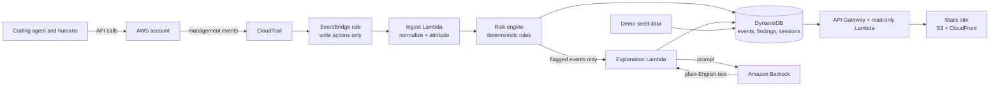

# Architecture

> **Status: draft design.** This describes the intended system. Anything marked *to verify* depends on inspecting real CloudTrail events and will be updated as the build confirms or changes it.

## Overview

AgentAudit watches write actions in an AWS account, works out which identity or session made each one, classifies its risk with deterministic rules, and explains flagged actions in plain English.

## Components

| Component | Responsibility | Notes |
|-----------|----------------|-------|
| CloudTrail | Source of truth for what happened in the account | Management events only |
| EventBridge rule | Routes write-action events to the ingest Lambda | Filters out read-only calls to control volume |
| Ingest Lambda | Normalizes each event and attaches attribution | One consistent event shape downstream |
| Risk engine | Applies the rules in [`risk-rules.md`](risk-rules.md) and assigns a severity | Deterministic: same event, same result, every time |
| Explanation Lambda | Asks Bedrock for a short explanation and suggested fix for flagged events | The model never decides severity |
| DynamoDB | Stores events, findings, and session timelines | TTL on every item so cost stays bounded |
| API Gateway + Lambda | Read-only API for the frontend | No write paths exposed publicly |
| S3 + CloudFront | Serves the static frontend | |
| Demo seed data | Pre-loaded events so the public site is meaningful with no live traffic | Marked clearly as demo data in the UI |

## Design principles

1. **Deterministic decisions, generative explanations.** Risk classification is rule-based so results are testable and explainable. The language model only writes prose for events the rules have already flagged.
2. **Read-only in public.** The public site can display findings but cannot change anything in any account.
3. **Redact by default.** Account IDs, ARNs, and IP addresses are masked before anything reaches the frontend.
4. **Bounded cost.** Small serverless pieces, write-only event filtering, and TTL on stored data, because the app must stay live through the judging window (into late October 2026).

## Attribution

The core question for every event is: **who made this call?** The coding agent uses its own dedicated AWS identity, separate from any human's, so its actions can be told apart in CloudTrail.

Open questions, to be answered from real events and recorded in [`process-log.md`](process-log.md):

- Which fields in the CloudTrail event identify the calling principal and session? *(to verify)*
- Is there a field or context value that marks a call as coming through the AWS MCP Server, or as a sign-in session belonging to an agent authorization? *(to verify)*
- Which region do the relevant events (including sign-in events) appear in, and therefore where must the EventBridge rule live? *(to verify)*
- Do global-service events, such as IAM, arrive through a different region than regional ones? *(to verify)*

Whatever the answers are, the ingest step reduces them to one normalized `actor` value on every stored event, so the rest of the system does not depend on CloudTrail's raw shape.

## Data model (draft)

- **Event:** normalized CloudTrail record, actor, timestamp, event name, redacted target, raw-event reference
- **Finding:** event reference, rule ID, severity, explanation text, suggested fix
- **Session:** actor, first and last event times, counts by severity, used for the per-session timeline

## Cost and lifecycle

- Serverless components only; nothing runs when nothing is happening.
- DynamoDB TTL expires stored events after a configurable number of days (`EVENT_TTL_DAYS`).
- A billing alert is set on the account before anything is deployed.